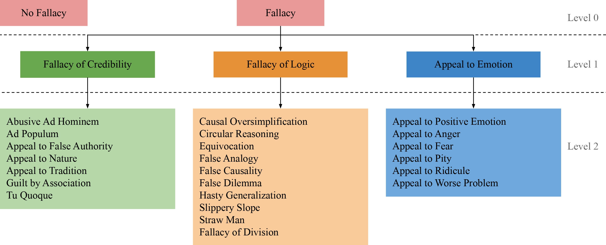

# MAFALDA (Multi-level Annotated Fallacy Dataset)



## Abstract
We introduce MAFALDA, a benchmark for fallacy classification that unites previous datasets. It comes with a taxonomy of fallacies that aligns, refines, and unifies previous classifications. We further provide a manual annotation of the dataset together with manual explanations for each annotation. We propose a new annotation scheme tailored for subjective NLP tasks, and a new evaluation method designed to handle subjectivity.<br/>
We then evaluate several language models under a zero-shot learning setting and human performances on MAFALDA to assess their fallacy detection and classification capability. 

[Paper Link](https://arxiv.org/pdf/2311.09761)

## Installation
```bash
git clone https://github.com/username/MAFALDA_NAACL.git
cd  MAFALDA_NAACL
pip install -r requirements.txt
```

## Run Experiment with Dummy Models
```bash
./run_dummy.sh
```

## Run Experiments with Local Models

### with GPU
```bash
./run_with_gpu.sh
```

### with CPU
```bash
./run_with_cpu.sh
```
## Run Experiments with OpenAI (GPT 3.5)
```bash
./run_with_openai.sh
```

## Run Evaluation
```bash
./run_eval.sh
```

## Citing

If you want to cite MAFALDA, please refer to the publication in the [Conference of the North American Chapter of the Association for Computational Linguistics](https://2024.naacl.org/):

```code
@inproceedings{helwe2023mafalda,
  title={MAFALDA: A Benchmark and Comprehensive Study of Fallacy Detection and Classification},
  author={Helwe, Chadi and Calamai, Tom and Paris, Pierre-Henri and Clavel, Chlo{\'e} and Suchanek, Fabian},
  booktitle={Conference of the North American Chapter of the Association for Computational Linguistics (NAACL)},
  year={2024}
}
```

## Acknowledgments

This work was partially funded by the NoRDF project (ANR-20-CHIA-0012-01), the SINNet project (ANR-23-CE23-0033-01) and Amundi Technology.
<!-- 
N.B: Code tested with Python 3.9.12 -->
